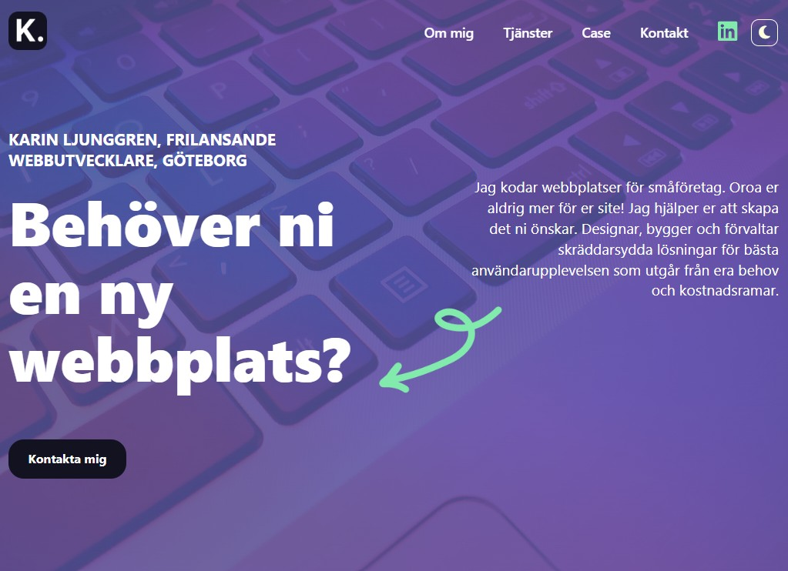

# Karin Ljunggren - frilans

## React course-Lab2

React project using the Vite tool and Contentful for Karin Ljunggren - frilans.

## Installation

To clone

`https://github.com/karinlj/karins-web.git`

To install

`cd karins-web`

`npm install`

To run

`npm run dev`

## Built With

- Vite
- React.js
- Contentful
- SCSS
- Fontawesome

## Author

- **Karin Ljunggren** - [karinlj](https://github.com/karinlj)

## License

This project is licensed under the MIT License - see the [LICENSE.md](LICENSE.md) file for details
